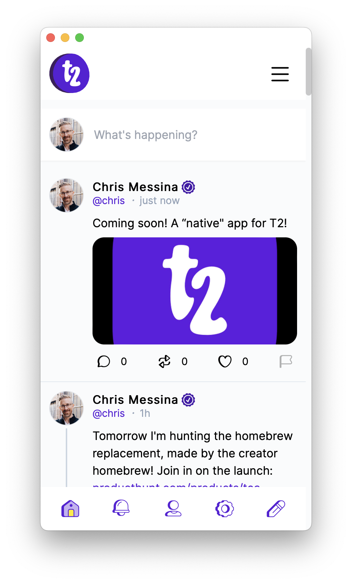

# t2.app

A lightweight wrapper around t2.social on MacOS. Based on [jcsalterego/Sky.app](https://github.com/jcsalterego/Sky.app).

## Download

Clone the repo or download the DMG from the [Releases](https://github.com/chrismessina/t2-dot-app/releases) page.

## Keyboard Shortcuts (__Coming soon__)

* `⌘-N` New Post
* `⌘-T` Open in Browser
* `⌘-1` Home
* `⌘-2` Search
* `⌘-3` Notifications
* `⌘-4` Profile

## Screenshot

## Credits

Built from a fork of jcsalterego's [Sky.app](https://github.com/jcsalterego/Sky.app).

## Changelog

### 0.0.1

* Initial release

## LICENSE

[2-Clause BSD](LICENSE)
